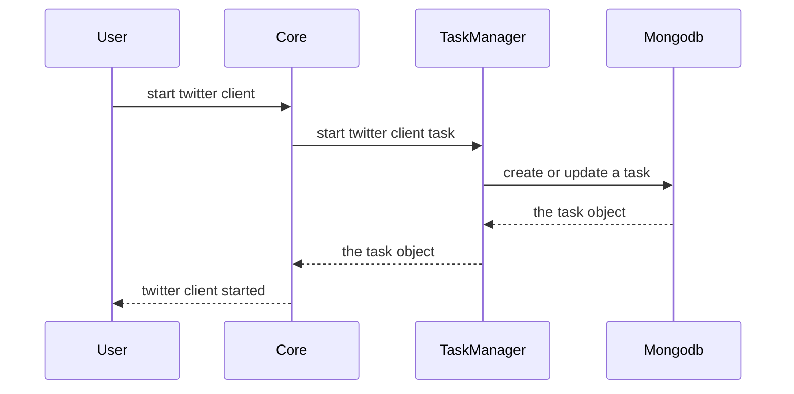
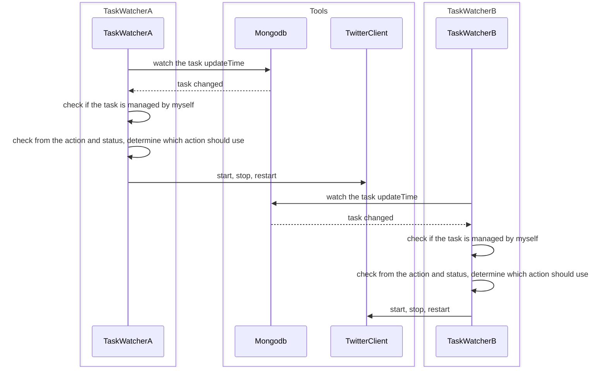

# sequence diagram

user start twitter client

```mermaid
sequenceDiagram
    User->>Core: start twitter client
    Core->>TaskManager: start twitter client task
    TaskManager->>Mongodb: create or update a task
    Mongodb-->>TaskManager: the task object
    TaskManager-->>Core: the task object
    Core-->>User: twitter client started
```

backend task watch the task status

```mermaid
sequenceDiagram
    box TaskWatcherA
    participant TaskWatcherA
    end

    box Tools
    participant Mongodb
    participant TwitterClient
    end

    box TaskWatcherB
    participant TaskWatcherB
    end

    TaskWatcherA->>Mongodb: watch the task updateTime
    Mongodb-->>TaskWatcherA: task changed

    TaskWatcherA->>TaskWatcherA: check if the task is managed by myself
    TaskWatcherA->>TaskWatcherA: check from the action and status, determine which action should use

    TaskWatcherA->>TwitterClient: start, stop, restart

    TaskWatcherB->>Mongodb: watch the task updateTime
    Mongodb-->>TaskWatcherB: task changed

    TaskWatcherB->>TaskWatcherB: check if the task is managed by myself
    TaskWatcherB->>TaskWatcherB: check from the action and status, determine which action should use

    TaskWatcherB->>TwitterClient: start, stop, restart

```
